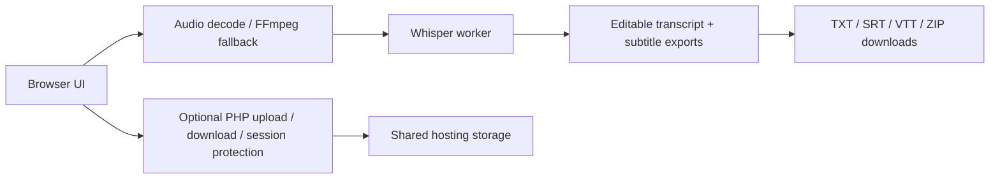

<div align="center">

# py-transcribe

<p>
  <strong>Browser-first transcription studio for constrained shared hosting.</strong><br />
  Whisper inference, audio decoding, transcript editing, and export generation all run in the browser.
  PHP stays small and only serves the shell, optional session protection, and optional host-side upload/download helpers.
</p>

<p>
  <a href="https://mytech.today/tools/transcribe/index.html"><strong>Open the live running version</strong></a>
  &nbsp;·&nbsp;
  <a href="#architecture-overview">Architecture</a>
  &nbsp;·&nbsp;
  <a href="#deployment-guide">Deploy</a>
  &nbsp;·&nbsp;
  <a href="#testing-checklist">Test</a>
</p>

</div>

> Live running version: [https://mytech.today/tools/transcribe/index.html](https://mytech.today/tools/transcribe/index.html)

<table>
  <tr>
    <td>
      <strong>Primary use</strong><br />
      Transcribe audio and video without shipping data to a backend service.
    </td>
    <td>
      <strong>Runtime</strong><br />
      Vite, browser workers, Whisper, and FFmpeg fallback when the browser cannot decode a file directly.
    </td>
  </tr>
  <tr>
    <td>
      <strong>Exports</strong><br />
      TXT, SRT, VTT, and ZIP bundles.
    </td>
    <td>
      <strong>Hosting model</strong><br />
      Works on constrained shared hosting with a lightweight PHP shell and optional storage.
    </td>
  </tr>
</table>

## What It Does

<table>
  <tr>
    <td>
      <strong>Local-first transcription</strong><br />
      Audio decoding, Whisper inference, and transcript rendering all happen in the browser.
    </td>
    <td>
      <strong>Flexible inputs</strong><br />
      Drag and drop media, browse for a local file, or record from the microphone and review it before transcribing.
    </td>
  </tr>
  <tr>
    <td>
      <strong>Editable outputs</strong><br />
      The transcript stays editable before you copy, export, or download it.
    </td>
    <td>
      <strong>Shared-hosting friendly</strong><br />
      PHP only handles serving the shell, optional session auth, and optional host backups.
    </td>
  </tr>
</table>

## Architecture Overview



## Key Stack

<table>
  <tr>
    <td><code>Vite</code></td>
    <td>Fast local development and a compact production bundle.</td>
  </tr>
  <tr>
    <td><code>Vanilla JavaScript</code></td>
    <td>Minimal browser overhead and simple deployment.</td>
  </tr>
  <tr>
    <td><code>@huggingface/transformers</code></td>
    <td>Browser-side Whisper inference.</td>
  </tr>
  <tr>
    <td><code>@ffmpeg/ffmpeg</code> + <code>@ffmpeg/util</code></td>
    <td>Codec fallback for files the browser cannot decode on its own.</td>
  </tr>
  <tr>
    <td><code>JSZip</code></td>
    <td>Client-side packaging for export bundles.</td>
  </tr>
  <tr>
    <td><code>PHP</code></td>
    <td>Shell serving, optional session auth, and small upload/download endpoints.</td>
  </tr>
</table>

## Project Layout

```text
web/
  app.js
  index.html
  styles.css
  lib/
  workers/
  public/
    index.php
    api/
    sw.js
    .htaccess
    storage/
tests/
  unit/
  e2e/
vite.config.mjs
playwright.config.mjs
package.json
```

## Deployment Guide

1. Install dependencies locally.
   ```powershell
   npm install
   ```
2. Build the browser bundle.
   ```powershell
   npm run build
   ```
3. Upload the generated `dist/` contents to your shared host, or to the document root your panel uses for this site.
4. Keep the PHP files and `.htaccess` files together with the built `index.html` and `assets/` folder.
5. If you want password protection, set `APP_PASSWORD_HASH` in [`web/public/api/bootstrap.php`](./web/public/api/bootstrap.php) to a `password_hash()` value.
6. Make sure the web user can write to `web/public/storage/` for optional backups.
7. Visit the site. The PHP entrypoint injects runtime config into the built HTML and serves the app shell.

> The app does not depend on a server-side Python runtime. Browser workers handle transcription and export generation.

## Usage

1. Open the app in a modern browser.
2. Click `Load Whisper / Python`.
3. Drop a file, click the drop zone to browse for one, or use `Record Mic` to capture audio from the microphone.
4. Review a recording in the embedded player if you captured one.
5. Pick the model, language, task, and cleanup options.
6. Click `Transcribe`.
7. Edit the transcript and download TXT, SRT, VTT, or ZIP outputs.

> The app saves settings, the selected file, and transcript data in browser storage on supported browsers, so a refresh should restore the session instead of resetting it.

## Limitations

<details>
  <summary><strong>Known tradeoffs</strong></summary>

  - First load still depends on downloading Whisper model files and browser worker assets.
  - Very large or exotic media files can still be slow or fail in some browsers.
  - Speaker labels are heuristic and not a true diarization system.
  - Translation mode changes transcript presentation, but inference still happens entirely in the browser.
</details>

## Troubleshooting

<details>
  <summary><strong>Common deployment issues</strong></summary>

  - If the console shows `Failed to resolve module specifier "jszip"`, the host is serving source files instead of the built bundle. Upload the generated `dist/` output and make sure `index.php` or `index.html` on the host comes from that build, not from `web/`.
  - If the app opens on `index.html` instead of the PHP shell, double-check the host's `DirectoryIndex` order and keep the `.htaccess` file in place.
</details>

## Testing Checklist

- `npm test`
- `npm run build`
- `npx playwright test`
- Confirm the app loads, accepts audio/video, records from the microphone, transcribes, and downloads exports.
- Confirm the optional PHP shell still serves the built `index.html` and `assets/` bundle.
