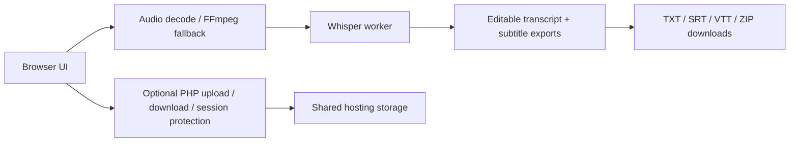

# py-transcribe

Browser-first transcription studio for constrained shared hosting. The browser handles audio decoding, Whisper inference, transcript editing, and exports. PHP only serves the shell, optional session protection, and optional host-side uploads/downloads.

## Architecture Overview



## Chosen Tech Stack

- `Vite` for fast local development and a small production bundle.
- Vanilla JavaScript for minimal browser overhead and easy shared-hosting deployment.
- `@huggingface/transformers` for browser-side Whisper inference.
- `@ffmpeg/ffmpeg` and `@ffmpeg/util` for codec fallback when the browser cannot decode a file directly.
- `JSZip` for client-side packaging of export files.
- PHP for static shell serving, optional session auth, and simple upload/download endpoints.

## File Structure

```text
web/
  app.js
  index.html
  styles.css
  lib/
  workers/
  public/
    index.php
    api/
    sw.js
    .htaccess
    storage/
tests/
  unit/
  e2e/
vite.config.mjs
playwright.config.mjs
package.json
```

## Deployment Guide

1. Install dependencies locally.
   ```powershell
   npm install
   ```
2. Build the browser bundle.
   ```powershell
   npm run build
   ```
3. Upload the contents of `dist/` into `web/public/` on your shared host, or into the site root if your panel uses a different document root.
4. Keep the PHP files and `.htaccess` files from `web/public/` in the same web directory as the generated `index.html` and `assets/` folder.
5. If you want password protection, set `APP_PASSWORD_HASH` in [`web/public/api/bootstrap.php`](./web/public/api/bootstrap.php) to a `password_hash()` value.
6. Make sure the web user can write to `web/public/storage/` for optional backups.
7. Visit the site. The PHP entrypoint will inject runtime config into the built HTML and serve the app shell.

The shared host’s `/usr/local/python-3.5` paths are not used by this app. No server-side Python runtime is required.

## Usage

1. Open the app in a modern browser.
2. Click `Load Python / Whisper`.
3. Drop a file, browse for one, or record from the microphone.
4. Pick the model, language, task, and cleanup options.
5. Click `Transcribe media`.
6. Edit the transcript and download TXT, SRT, VTT, or ZIP outputs.

## Limitations

- First load still depends on downloading Whisper model files and browser worker assets.
- Very large or exotic media files can still be slow or fail in some browsers.
- Speaker labels are heuristic and not a true diarization system.
- Translation mode changes the transcript presentation, but it is still browser-side inference with no paid API.

## Troubleshooting

- If the console shows `Failed to resolve module specifier "jszip"`, the host is serving source files instead of the built bundle. Upload the generated `dist/` output and make sure `index.php` or `index.html` on the host comes from that build, not from `web/`.
- If the app opens on `index.html` instead of the PHP shell, double-check the host’s `DirectoryIndex` order and keep the `.htaccess` file in place.

## Testing Checklist

- `npm test`
- `npm run build`
- `npx playwright test`
- Confirm the app loads, accepts audio/video, transcribes, and downloads exports.
- Confirm the optional PHP shell still serves the built `index.html` and `assets/` bundle.
